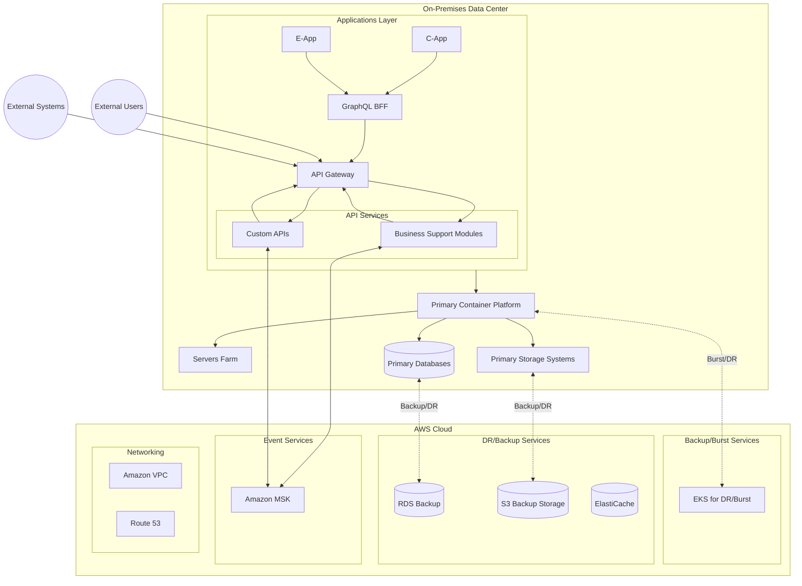

# AWS Hybrid Cloud Architecture Guide

## Overview
This document outlines a hybrid cloud architecture leveraging both AWS cloud services and on-premises infrastructure. The architecture includes Amazon RDS, ElastiCache, S3, and MSK (Managed Streaming for Apache Kafka) integrated with on-premises resources.

## Architecture Diagram 

## Architecture Components

### On-Premises Components
1. **Applications Layer**
   - **C-App**: New CX and business processes workflow application
   - **E-App**: New business processes and workflow automation stack for employees
   - **API Services**: Service endpoints for internal and external integrations
     - **Business Support Modules**: Core business functionality APIs
     - **Custom APIs**: Custom-built integration endpoints
   - **GraphQL BFF**: Backend-For-Frontend for data aggregation
   - **API Gateway**: Central entry point for API traffic management

2. **Primary Container Platform**
   - Main container orchestration environment
   - Production workload hosting
   - Container lifecycle management

3. **Primary Databases**
   - Production databases
   - Business-critical data storage
   - Transactional systems

4. **Primary Storage Systems**
   - Main storage infrastructure
   - Business data and documents
   - Application assets

5. **Servers Farm**
   - Primary compute resources
   - Application processing
   - Workload management

### AWS Cloud Components
1. **Backup/Burst Services**
   - **EKS for DR/Burst**: Elastic Kubernetes Service for backup and scaling
   - Handles overflow capacity
   - Supports disaster recovery

2. **DR/Backup Services**
   - **RDS Backup**: Database backup and replication
   - **S3 Backup Storage**: Object storage backup
   - **ElastiCache**: In-memory data caching

3. **Event Services**
   - **MSK**: Managed Kafka service
   - Event streaming platform
   - Asynchronous messaging

4. **Networking**
   - **VPC**: Virtual Private Cloud infrastructure
   - **Route53**: DNS and routing services

### External Components
- **External Users**: End users and customers
- **External Systems**: Partner systems and third-party services

### Connection Types
- **Solid Lines (→)**: Primary data flow
- **Dotted Lines (--->)**: Backup and DR connections
- **Bidirectional Lines (<-->)**: Two-way communication

## Components Description

### 1. Network Connectivity
- **AWS Direct Connect**: Dedicated network connection from on-premises to AWS
- **VPN**: Secure backup connection
- **VPC**: Virtual Private Cloud for secure AWS resource deployment

### 2. Database Services

#### Amazon RDS (Relational Database Service)
- Managed relational database service
- Supports multiple database engines (MySQL, PostgreSQL, Oracle, SQL Server)
- Hybrid configuration:
  - Primary database in AWS
  - Read replicas on-premises
  - Cross-region replication for disaster recovery

#### Amazon ElastiCache
- In-memory caching service
- Supports Redis and Memcached
- Use cases:
  - Session management
  - Real-time analytics
  - Gaming leaderboards

### 3. Storage Services

#### Amazon S3 (Simple Storage Service)
- Object storage service
- Use cases:
  - Backup and archive
  - Data lake
  - Static website hosting
- Hybrid features:
  - S3 Storage Gateway
  - AWS DataSync

### 4. Amazon MSK (Managed Streaming for Apache Kafka)
- Fully managed Apache Kafka service
- Use cases:
  - Real-time data streaming
  - Log aggregation
  - Event sourcing
- Hybrid integration:
  - Connect on-premises producers/consumers
  - Mirror Maker 2.0 for cluster replication

### 5. API Gateway Services
- **On-Premises API Gateway**
  - Central point for API traffic management
  - Request routing and transformation
  - Authentication and authorization
  - Rate limiting and throttling
  - Integration with existing security systems

- **External Integration Features**
  - Partner API access
  - B2B integration
  - Mobile application support
  - Third-party system integration
  - API documentation and developer portal

- **Security Controls**
  - OAuth2/OIDC integration
  - API key management
  - JWT validation
  - IP whitelisting
  - WAF protection

## Implementation Best Practices

### Security
1. Use AWS Direct Connect for secure, dedicated connectivity
2. Implement encryption at rest and in transit
3. Use AWS IAM for access control
4. Enable VPC endpoints for AWS services

### Performance
1. Use caching strategies with ElastiCache
2. Implement read replicas for RDS
3. Use S3 Transfer Acceleration for faster uploads
4. Configure proper Kafka partitioning in MSK

### High Availability
1. Deploy across multiple Availability Zones
2. Implement database failover
3. Use S3 cross-region replication
4. Configure MSK multi-AZ deployment

## Monitoring and Management

### AWS Services
- CloudWatch for metrics and logging
- AWS Config for resource tracking
- AWS Systems Manager for operations
- AWS CloudTrail for API activity logging

### On-Premises Integration
- AWS Systems Manager for hybrid management
- AWS Directory Service for identity management
- AWS Control Tower for governance

## Cost Optimization

### Best Practices
1. Use Reserved Instances for predictable workloads
2. Implement S3 lifecycle policies
3. Monitor and optimize ElastiCache node sizes
4. Right-size RDS instances

## Disaster Recovery

### Strategy
1. Backup and Restore
   - Regular RDS snapshots
   - S3 cross-region replication
   - MSK cluster backup

2. Failover Planning
   - Multi-AZ deployments
   - Cross-region replication
   - Pilot light or warm standby setup

## Benefits of Hybrid Cloud Solution

### Business Benefits
1. **Risk Mitigation**
   - Maintain critical workloads on-premises
   - Geographic redundancy
   - Reduced vendor lock-in
   - Compliance with data sovereignty requirements

2. **Cost Optimization**
   - Pay-as-you-go for cloud resources
   - Optimize existing on-premises investments
   - Reduce capital expenditure
   - Flexible resource allocation

3. **Operational Excellence**
   - Automated infrastructure management
   - Reduced maintenance overhead
   - Access to managed services
   - Simplified disaster recovery

4. **Performance Benefits**
   - Local data processing for latency-sensitive applications
   - Cloud bursting for peak demands
   - Global content delivery
   - Enhanced application availability

5. **Innovation Enablement**
   - Access to cloud-native services
   - Rapid prototyping and testing
   - Modern development practices
   - Easy integration with emerging technologies

6. **Business Continuity**
   - Enhanced disaster recovery capabilities
   - Geographic distribution of workloads
   - Improved backup solutions
   - High availability options

7. **Scalability and Flexibility**
   - On-demand resource scaling
   - Workload portability
   - Environment consistency
   - Future-proof architecture

8. **Security and Compliance**
   - Advanced security tools
   - Centralized security management
   - Compliance framework support
   - Regular security updates

9. **Transition Benefits**
   - Gradual cloud adoption
   - Controlled migration pace
   - Risk-managed transformation
   - Preserve existing investments

10. **Operational Benefits**
    - Simplified infrastructure management
    - Automated maintenance
    - Reduced technical debt
    - Access to managed services expertise

## Conclusion
This hybrid cloud architecture provides a robust foundation for organizations looking to leverage both on-premises and AWS cloud resources. Regular assessment and optimization of the architecture ensure optimal performance and cost-effectiveness.

---

## References
- [AWS Direct Connect Documentation](https://aws.amazon.com/directconnect/)
- [Amazon RDS Documentation](https://aws.amazon.com/rds/)
- [Amazon ElastiCache Documentation](https://aws.amazon.com/elasticache/)
- [Amazon S3 Documentation](https://aws.amazon.com/s3/)
- [Amazon MSK Documentation](https://aws.amazon.com/msk/)