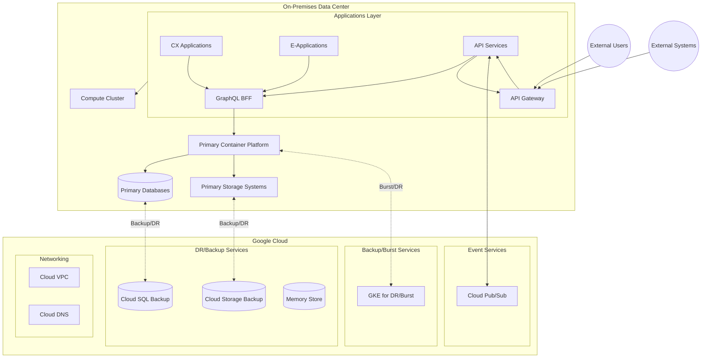

# GCP Hybrid Cloud Architecture Guide

## Overview
This document outlines a hybrid cloud architecture leveraging both Google Cloud Platform (GCP) services and on-premises infrastructure. The architecture includes Google Kubernetes Engine (GKE), Cloud Storage, Cloud SQL, and Pub/Sub integrated with on-premises resources.

## Architecture Diagram 

## Architecture Components

### On-Premises Components
1. **Applications Layer**
   - **CX Applications**: Customer experience applications and portals
   - **E-Applications**: Enterprise business applications and workflows
   - **API Services**: Internal and external API endpoints
   - **GraphQL BFF**: Backend-For-Frontend for data aggregation
   - **API Gateway**: Central entry point for API traffic management

2. **Primary Container Platform**
   - Main container orchestration environment
   - Production workload hosting
   - Container lifecycle management

3. **Primary Databases**
   - Production databases
   - Business-critical data storage
   - Transactional systems

4. **Primary Storage Systems**
   - Main storage infrastructure
   - Business data and documents
   - Application assets

5. **Compute Cluster**
   - Primary compute resources
   - Application processing
   - Workload management

### GCP Cloud Components
1. **Backup/Burst Services**
   - **GKE for DR/Burst**: Google Kubernetes Engine for backup and scaling
   - Handles overflow capacity
   - Supports disaster recovery

2. **DR/Backup Services**
   - **Cloud SQL Backup**: Database backup and replication
   - **Cloud Storage Backup**: Object storage backup
   - **Memory Store**: In-memory data caching

3. **Event Services**
   - **Pub/Sub**: Managed message queue service
   - Event streaming platform
   - Asynchronous messaging

4. **Networking**
   - **Cloud VPC**: Virtual network infrastructure
   - **Cloud DNS**: Domain name services

### External Components
- **External Users**: End users and customers
- **External Systems**: Partner systems and third-party services

### Connection Types
- **Solid Lines (→)**: Primary data flow
- **Dotted Lines (--->)**: Backup and DR connections
- **Bidirectional Lines (<-->)**: Two-way communication

## Core Components

### 1. Hybrid Connectivity
- **Cloud Interconnect**
  - Dedicated, high-bandwidth connection
  - Low latency (2-10ms)
  - 99.99% availability SLA
  - Supports 10Gbps or 100Gbps links

- **Cloud VPN**
  - Secure IPsec connection
  - Backup connectivity option
  - HA configuration available
  - Up to 3Gbps per tunnel

### 2. Compute Services (GKE)
- **GKE Features**
  - Autopilot mode for serverless operations
  - Multi-cluster management
  - Integrated load balancing
  - Automated scaling
  - Built-in security features

- **Hybrid Capabilities**
  - Anthos for multi-cluster management
  - Connect to on-premises Kubernetes
  - Unified control plane
  - Consistent policies across environments

### 3. Data Services

#### Cloud SQL
- **Features**
  - Automated backups and patches
  - Point-in-time recovery
  - Encryption at rest/in transit
  - Read replicas for scaling

- **Supported Engines**
  - PostgreSQL
  - MySQL
  - SQL Server

#### Cloud Storage
- **Storage Classes**
  - Standard (frequent access)
  - Nearline (monthly access)
  - Coldline (quarterly access)
  - Archive (yearly access)

- **Features**
  - Object versioning
  - Lifecycle management
  - Strong consistency
  - Customer-managed encryption keys

### 4. Messaging (Pub/Sub)
- **Features**
  - Global message bus
  - At-least-once delivery
  - Push/pull subscriptions
  - Message retention

- **Integration Patterns**
  - Event-driven architecture
  - Microservices communication
  - Data streaming
  - Analytics pipelines

### 5. API Gateway Infrastructure
- **Gateway Features**
  - Centralized API management
  - Traffic routing and load balancing
  - Request/response transformation
  - API versioning
  - Developer portal integration

- **Integration Capabilities**
  - REST API support
  - GraphQL endpoints
  - WebSocket support
  - External partner access
  - Legacy system integration

- **Security Framework**
  - Authentication services
  - Authorization policies
  - Rate limiting
  - Traffic monitoring
  - Threat protection

## Implementation Guidelines

### Security Best Practices
1. **Identity and Access**
   - Use Cloud Identity for SSO
   - Implement least privilege
   - Regular access reviews
   - Service account key rotation

2. **Network Security**
   - VPC Service Controls
   - Cloud Armor for DDoS protection
   - Private Google Access
   - Security Command Center

3. **Data Protection**
   - Cloud KMS for key management
   - Customer-managed encryption keys
   - Data classification
   - Regular security audits

### High Availability Design
1. **Regional Deployment**
   - Multi-zone GKE clusters
   - Cloud SQL HA configuration
   - Regional Cloud Storage buckets
   - Load balancer redundancy

2. **Disaster Recovery**
   - Cross-region backups
   - Failover procedures
   - Regular DR testing
   - Recovery time objectives (RTO/RPO)

## Monitoring and Operations

### Observability Stack
- **Cloud Monitoring**
  - Infrastructure metrics
  - Application performance
  - Custom dashboards
  - Alerts and notifications

- **Cloud Logging**
  - Centralized logs
  - Log-based metrics
  - Audit logs
  - Export capabilities

### Operations Tools
- **Cloud Operations**
  - Service monitoring
  - Error reporting
  - Trace analysis
  - Debugger integration

## Cost Optimization

### Cost Control Measures
1. **Committed Use Discounts**
   - 1-year or 3-year terms
   - Up to 70% savings
   - Applicable to compute resources

2. **Storage Optimization**
   - Lifecycle policies
   - Object versioning
   - Storage class selection
   - Compression where applicable

3. **Database Optimization**
   - Right-sizing instances
   - Read replica planning
   - Backup retention policies

## Migration Strategy

### Phase 1: Assessment
- Application inventory
- Dependency mapping
- Performance requirements
- Compliance needs

### Phase 2: Planning
- Architecture design
- Network planning
- Security controls
- Testing strategy

### Phase 3: Implementation
- Network connectivity
- Initial workload migration
- Service integration
- Validation testing

### Phase 4: Optimization
- Performance tuning
- Cost optimization
- Process automation
- Documentation

## References
- [GCP Documentation](https://cloud.google.com/docs)
- [GKE Best Practices](https://cloud.google.com/kubernetes-engine/docs/best-practices)
- [Cloud SQL Documentation](https://cloud.google.com/sql/docs)
- [Cloud Storage Documentation](https://cloud.google.com/storage/docs)
- [Pub/Sub Documentation](https://cloud.google.com/pubsub/docs)

## Benefits of Hybrid Cloud Solution

### Business Benefits
1. **Strategic Advantages**
   - Leverage existing infrastructure investments
   - Phased cloud adoption approach
   - Future-ready architecture
   - Access to innovative cloud services

2. **Operational Benefits**
   - Automated infrastructure management
   - Reduced maintenance burden
   - Managed service advantages
   - Simplified operations

3. **Financial Benefits**
   - Optimized resource utilization
   - Reduced capital expenditure
   - Pay-per-use model
   - Better cost prediction

4. **Technical Benefits**
   - Modern architecture patterns
   - Enhanced scalability
   - Improved reliability
   - Access to cloud-native services

5. **Security and Compliance**
   - Advanced security features
   - Compliance framework support
   - Enhanced data protection
   - Regular security updates

6. **Performance Optimization**
   - Local processing for low-latency needs
   - Global content delivery
   - Flexible resource allocation
   - Load distribution capabilities

7. **Risk Management**
   - Reduced vendor lock-in
   - Geographic redundancy
   - Enhanced disaster recovery
   - Data sovereignty compliance

8. **Innovation Enablement**
   - Access to cutting-edge technologies
   - Rapid prototyping capabilities
   - Modern development practices
   - Easy integration with new services

9. **Flexibility and Control**
   - Workload placement choice
   - Data locality control
   - Resource management flexibility
   - Environment consistency

10. **Long-term Benefits**
    - Sustainable growth path
    - Future-proof architecture
    - Simplified modernization
    - Continuous innovation capability