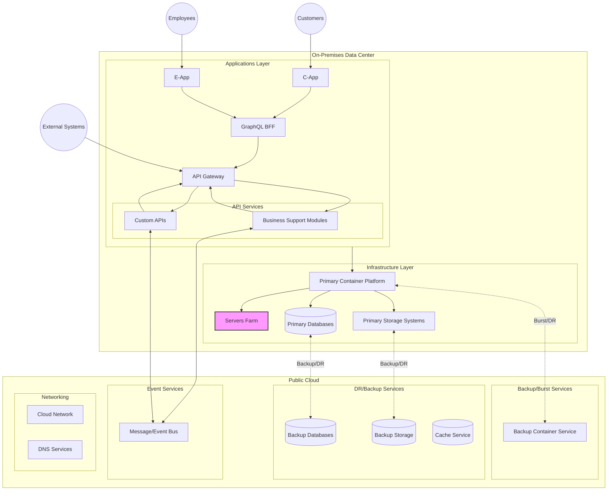

# Generic Hybrid Cloud Architecture Guide

## Overview
This document outlines a provider-agnostic hybrid cloud architecture that combines on-premises infrastructure with public cloud services. The architecture focuses on core services including container orchestration, database services, storage solutions, and messaging systems.

## Architecture Diagram 

## Architecture Components

### On-Premises Components
1. **Applications Layer**
   - **C-App**: New CX and business processes workflow application
   - **E-App**: New business processes and workflow automation stack for employees
   - **API Services**: Service endpoints for internal and external integrations
     - **Business Support Modules**: Core business functionality APIs
     - **Custom APIs**: Custom-built integration endpoints
   - **GraphQL BFF**: Backend-For-Frontend for data aggregation
   - **API Gateway**: Central entry point for API traffic management

2. **Primary Container Platform**
   - Primary orchestration platform for containerized applications
   - Hosts microservices and application workloads
   - Manages container lifecycle and scaling

3. **Primary Databases**
   - Main operational databases for business data
   - Transactional and analytical data storage
   - Critical business data repositories

4. **Primary Storage Systems**
   - Primary file and object storage systems
   - Business document and media storage
   - Application data storage

5. **Servers Farm**
   - Main processing infrastructure
   - Hosts compute-intensive workloads
   - Manages application processing needs

### Cloud Components
1. **Backup/Burst Services**
   - **Backup Container Service**: Secondary container platform for DR and scaling
   - Provides burst capacity during peak loads
   - Supports development and testing environments

2. **DR/Backup Services**
   - **Backup Databases**: Secondary database systems for DR
   - **Backup Storage**: Secondary storage for data protection
   - **Cache Service**: Distributed caching for performance

3. **Event Services**
   - **Message/Event Bus**: Enterprise messaging and event streaming
   - Enables asynchronous communication
   - Supports event-driven architecture

4. **Networking**
   - **Cloud Network**: Cloud connectivity services
   - **DNS Services**: Domain name resolution and routing

### External Components
- **External Users**: End users accessing applications and services
- **External Systems**: Third-party systems and partner integrations

### Connection Types
- **Solid Lines (→)**: Primary application traffic flow
- **Dotted Lines (--->)**: Backup and DR replication paths
- **Bidirectional Lines (<-->)**: Two-way communication flows

## Core Components

### 1. Hybrid Connectivity
- **Dedicated Connection**
  - High-bandwidth, low-latency connection
  - Typical bandwidth: 1-100 Gbps
  - Enterprise-grade SLA (99.9%+)
  - Direct routing to cloud services

- **VPN Connection**
  - Encrypted tunnel over internet
  - Backup connectivity
  - High-availability options
  - Cost-effective for smaller workloads

### 2. Container Orchestration
- **Managed Kubernetes Features**
  - Automated cluster management
  - Multi-cluster operations
  - Built-in auto-scaling
  - Load balancing integration
  - Security controls

- **Hybrid Capabilities**
  - Unified control plane
  - Consistent policies
  - Workload portability
  - Central monitoring

### 3. Data Services

#### Managed Databases
- **Features**
  - Automated maintenance
  - Backup management
  - High availability options
  - Scalability features
  - Performance monitoring

- **Common Options**
  - Relational databases
  - NoSQL databases
  - In-memory caching
  - Data warehousing

#### Object Storage
- **Characteristics**
  - Scalable capacity
  - Multiple storage tiers
  - Global accessibility
  - Strong consistency

- **Features**
  - Versioning
  - Lifecycle management
  - Access controls
  - Encryption options

### 4. Event/Messaging Services
- **Capabilities**
  - Reliable message delivery
  - Event streaming
  - Pub/sub patterns
  - Message persistence

- **Use Cases**
  - Application integration
  - Event-driven architecture
  - Real-time processing
  - Data pipelines

### 5. API Gateway
- **Features**
  - API traffic management
  - Request routing and transformation
  - Authentication and authorization
  - Rate limiting and throttling
  - Request/response validation
  - API documentation

- **Integration Patterns**
  - REST APIs
  - GraphQL endpoints
  - WebSocket APIs
  - Service mesh integration
  - External partner integration

- **Security Features**
  - OAuth2/OIDC integration
  - API key management
  - JWT validation
  - IP whitelisting
  - WAF integration

## Implementation Guidelines

### Security Framework
1. **Identity Management**
   - Single sign-on (SSO)
   - Role-based access control
   - Regular access reviews
   - Identity federation

2. **Network Security**
   - Segmentation
   - DDoS protection
   - Traffic filtering
   - Encryption in transit

3. **Data Protection**
   - Encryption at rest
   - Key management
   - Data classification
   - Access logging

### High Availability Strategy
1. **Multi-Region Design**
   - Geographic distribution
   - Load balancing
   - Failover automation
   - Data replication

2. **Disaster Recovery**
   - Regular backups
   - Recovery testing
   - RTO/RPO planning
   - Business continuity

## Monitoring and Operations

### Observability
- **Metrics**
  - Performance monitoring
  - Resource utilization
  - Business KPIs
  - Cost tracking

- **Logging**
  - Centralized logs
  - Log analytics
  - Audit trails
  - Compliance reporting

### Management Tools
- **Operations**
  - Configuration management
  - Automation tools
  - Change control
  - Incident response

## Cost Management

### Optimization Strategies
1. **Resource Planning**
   - Capacity planning
   - Reserved capacity
   - Auto-scaling policies
   - Resource tagging

2. **Storage Management**
   - Tiered storage
   - Data lifecycle
   - Compression
   - Deduplication

## Migration Framework

### Phases
1. **Assessment**
   - Workload analysis
   - Dependency mapping
   - Risk assessment
   - Compliance review

2. **Planning**
   - Architecture design
   - Network planning
   - Security planning
   - Migration strategy

3. **Execution**
   - Phased migration
   - Testing
   - Validation
   - Performance tuning

4. **Optimization**
   - Monitoring
   - Cost optimization
   - Process improvement
   - Documentation

## Benefits

### Business Value
1. **Strategic Benefits**
   - Infrastructure flexibility
   - Innovation enablement
   - Risk mitigation
   - Future-proofing

2. **Operational Benefits**
   - Reduced complexity
   - Improved reliability
   - Enhanced security
   - Better scalability

3. **Financial Benefits**
   - OpEx vs CapEx
   - Cost optimization
   - Resource efficiency
   - Predictable spending

4. **Technical Benefits**
   - Modern architecture
   - Advanced capabilities
   - Automated operations
   - Enhanced security

## Best Practices

1. **Architecture**
   - Design for portability
   - Implement automation
   - Use infrastructure as code
   - Plan for scale

2. **Operations**
   - Standardize processes
   - Automate operations
   - Monitor everything
   - Regular testing

3. **Security**
   - Defense in depth
   - Zero trust model
   - Regular audits
   - Compliance monitoring

4. **Cost Control**
   - Resource optimization
   - Usage monitoring
   - Budget controls
   - Regular review

## References
- [NIST Cloud Computing Standards](https://www.nist.gov/programs-projects/nist-cloud-computing-program-nccp)
- [Cloud Security Alliance](https://cloudsecurityalliance.org/)
- [The Open Group Cloud Computing Standards](https://www.opengroup.org/cloud)
- [Cloud Native Computing Foundation](https://www.cncf.io/)