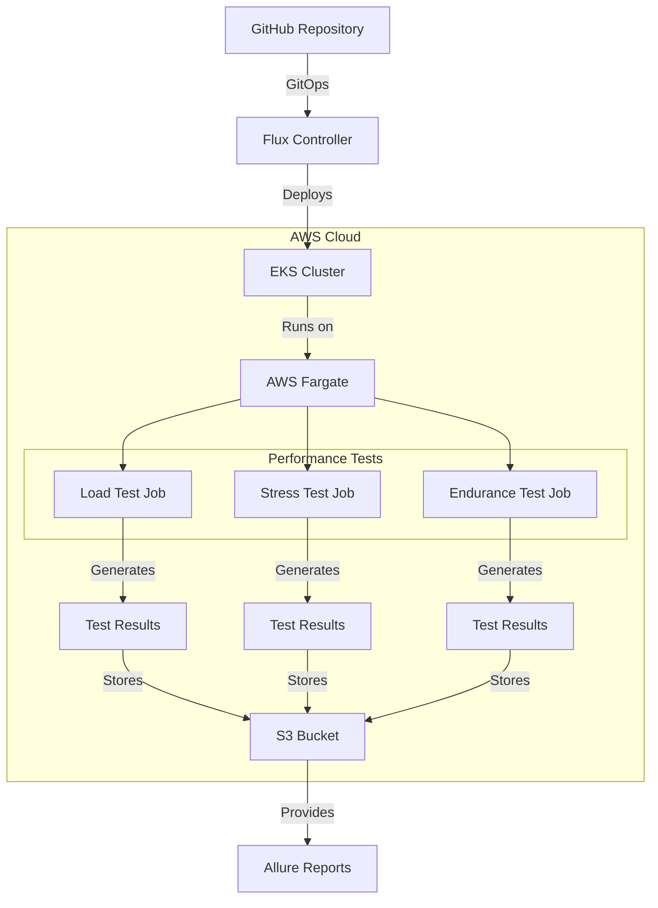
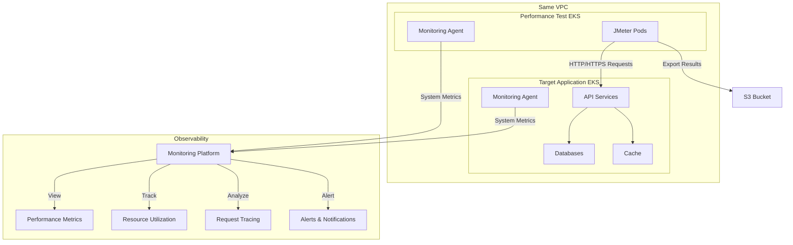

### **📌 Performance Testing for Load, Stress, and Endurance on Serverless EKS with Flux**

#### **🔄 GitOps Workflow and Test Execution Architecture**


#### **🔗 Inter-Cluster Communication Architecture**


### **🎯 Cluster Separation Strategy**
We deliberately separate the performance testing infrastructure from the target application cluster for several critical reasons:

1. **Resource Isolation**
   - Prevents performance tests from consuming application cluster resources
   - Ensures test load generation isn't constrained by application resource limits
   - Maintains application performance for real users during testing

2. **Accurate Results**
   - Eliminates resource contention between test tools and application
   - Provides more reliable and consistent test measurements
   - Better reflects real-world user experience

3. **Operational Safety**
   - Reduces risk of impacting production workloads
   - Allows aggressive testing without compromising application stability
   - Enables independent scaling of test infrastructure

Since you are running JMeter on a separate **serverless EKS cluster**, we will optimize the solution to:  
✔ **Automate deployment and configuration** using **Flux for GitOps**.  
✔ **Run everything on AWS Fargate for a fully serverless setup.**  
✔ **Run different test types (Load, Stress, Endurance).**  
✔ **Ensure long-running endurance tests persist data.**  
✔ **Capture and analyze system metrics.**  

---

## **🛠️ Kubernetes Setup for Performance Testing**
Instead of **physical nodes**, we will use:  
✔ **Fargate for all performance tests** (Load, Stress, and Endurance).  
✔ **Flux to manage all Kubernetes manifests via GitOps.**  

---

## **🎯 Types of Performance Tests**

### **📊 Load Testing**
Load testing simulates expected real-world usage to:
- Verify system behavior under normal and peak load conditions
- Measure response times, throughput, and resource utilization
- Ensure the system meets performance requirements
- Identify performance bottlenecks under expected load
- Typically runs for 1-2 hours with gradual user increase

### **💪 Stress Testing**
Stress testing pushes the system beyond normal operating capacity to:
- Find the breaking point of the system
- Understand failure modes and recovery behavior
- Identify maximum capacity limits
- Test system stability under extreme conditions
- Usually runs for shorter periods (30-60 minutes) with aggressive load

### **⏳ Endurance Testing**
Endurance testing (also called soak testing) runs for extended periods to:
- Detect memory leaks and resource depletion
- Verify system stability over time
- Identify performance degradation patterns
- Test system recovery and maintenance processes
- Typically runs for 24-72 hours under sustained load

## **🔹 1. Setting Up the Serverless EKS Cluster for Performance Testing with Flux**
### **📌 Deploying EKS with eksctl**
#### **📝 `eks-cluster.yaml` (Using Fargate & Flux)**
```yaml
apiVersion: eksctl.io/v1alpha5
kind: ClusterConfig

metadata:
  name: perf-test-cluster
  region: eu-west-1

fargateProfiles:
  - name: performance-tests
    selectors:
      - namespace: performance-tests

addons:
  - name: vpc-cni
  - name: coredns
  - name: kube-proxy
  - name: fluxcd
```

### **📌 Deploying Flux to Manage Configurations**
#### **📝 Installing Flux on EKS**
```sh
flux bootstrap github \
  --owner=your-github-org \
  --repository=performance-testing \
  --branch=main \
  --path=clusters/perf-test-cluster
```

---

## **🔹 2. Running Different Types of Performance Tests with Flux**
### **📌 2.1. Load Test (Gradual Load Increase)**
✔ **Runs entirely on AWS Fargate**  
✔ **Monitors response time under load**  

#### **📝 `load-test-job.yaml`**
```yaml
apiVersion: batch/v1
kind: Job
metadata:
  name: jmeter-load-test
  namespace: performance-tests
spec:
  template:
    spec:
      containers:
      - name: jmeter
        image: justb4/jmeter:latest
        command: ["/bin/sh", "-c"]
        args:
          - |
            jmeter -n -t /test-plan.jmx -l /results/results.jtl -e -o /results/allure-report
            tar -czvf /results/allure-report.tar.gz -C /results allure-report
        volumeMounts:
        - name: test-plan
          mountPath: /test-plan.jmx
          subPath: test-plan.jmx
        - name: results
          mountPath: /results
      restartPolicy: Never
      volumes:
      - name: test-plan
        configMap:
          name: jmeter-test-plan
      - name: results
        emptyDir: {}
```

---

### **📌 2.2. Stress Test (Breaking Point)**
✔ **Runs entirely on AWS Fargate**  
✔ **Identifies failure thresholds**  

#### **📝 `stress-test-job.yaml`**
```yaml
apiVersion: batch/v1
kind: Job
metadata:
  name: jmeter-stress-test
  namespace: performance-tests
spec:
  template:
    spec:
      containers:
      - name: jmeter
        image: justb4/jmeter:latest
        command: ["/bin/sh", "-c"]
        args:
          - |
            jmeter -n -t /test-plan.jmx -Jthreads=200 -Jramp-up=60 -l /results/results.jtl -e -o /results/allure-report
            tar -czvf /results/allure-report.tar.gz -C /results allure-report
        volumeMounts:
        - name: test-plan
          mountPath: /test-plan.jmx
          subPath: test-plan.jmx
        - name: results
          mountPath: /results
      restartPolicy: Never
      volumes:
      - name: test-plan
        configMap:
          name: jmeter-test-plan
      - name: results
        emptyDir: {}
```

🔹 **Flux applies updates automatically when changes are committed to Git.**  

---

### **📌 2.3. Endurance Test (Long-Running Test)**
✔ **Runs entirely on AWS Fargate**  
✔ **Logs memory and CPU usage continuously**  
✔ **Persists logs in S3**  

#### **📝 `endurance-test-job.yaml`**
```yaml
apiVersion: batch/v1
kind: Job
metadata:
  name: jmeter-endurance-test
  namespace: performance-tests
spec:
  template:
    spec:
      containers:
      - name: jmeter
        image: justb4/jmeter:latest
        command: ["/bin/sh", "-c"]
        args:
          - |
            jmeter -n -t /test-plan.jmx -Jduration=10800 -l /results/results.jtl -e -o /results/allure-report
            tar -czvf /results/allure-report.tar.gz -C /results allure-report
            aws s3 cp /results/allure-report.tar.gz s3://your-s3-bucket/endurance-test-results/
        volumeMounts:
        - name: test-plan
          mountPath: /test-plan.jmx
          subPath: test-plan.jmx
        - name: results
          mountPath: /results
      restartPolicy: Never
      volumes:
      - name: test-plan
        configMap:
          name: jmeter-test-plan
      - name: results
        emptyDir: {}
```
🔹 **Flux ensures test configurations are always in sync with the repository.**  

---

## **🎯 Summary**
✔ **Serverless EKS cluster using AWS Fargate**  
✔ **Uses Flux GitOps for automated deployments**  
✔ **Runs all tests on Fargate (no EC2 instances required)**  
✔ **Includes Load, Stress, and Endurance testing**  
✔ **Uploads Allure reports to S3**  


